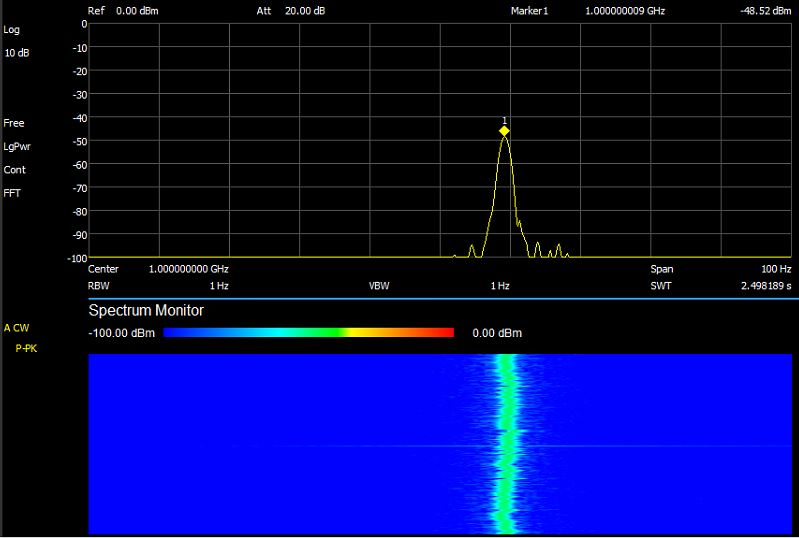

# Arduino_SI5351_GPSDO

Very simple Arduino nano and SI5351 GPSDO using the PPS from a GPS receiver based on:
 http://roland.cordesses.free.fr/GPS_Si2cor.html

and using a phase detector as described in:
https://www.eevblog.com/forum/projects/lars-diy-gpsdo-with-arduino-and-1ns-resolution-tic/

 Instead of a fixed 40 seconds measuring time this version scales the measurement time with the measured stability.
 Shortest measurement time is 1 second giving a 400 part per bilion resolution for frequency correction.
 Max measurement time is 4000 seconds allowing to use the full 1 part per 10 bilion resolution of the frequency correction.

 The serial input from the GPS is not needed, only the PPS pulse. This allows to use the nano USB serial port for status messages and loading new software without having to  decouple the GPS serial.
 The rest of the ino file is simplified
 
 
 It is highly recommended to replace the XTal on the SI5351 module with a cheap 26MHz TCXO as the temperature dependency of the XTal makes the SI5351 unstable.
 It is also possible to improve stability by thermally isolating the whole SI5351 module or increasing the thermal innertia of the XTal by gluing a large piece of metal on it.
 
 The phase detector is optionally but will inprove locking speed and accuracy
 

 
 A discussion on this design can be found here:
 https://groups.io/g/HBTE/topic/82748369#1698
